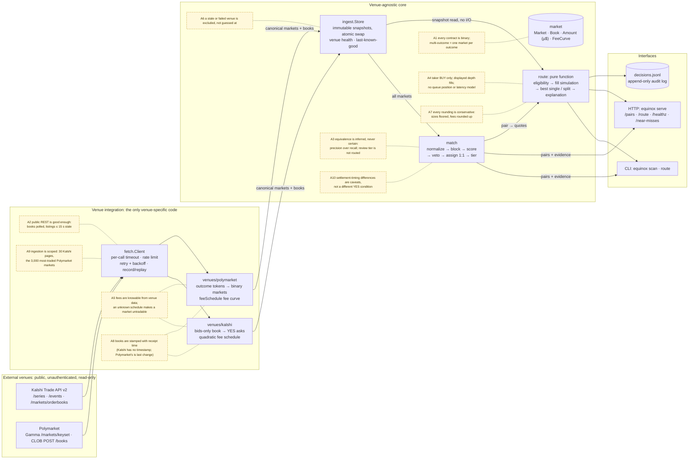
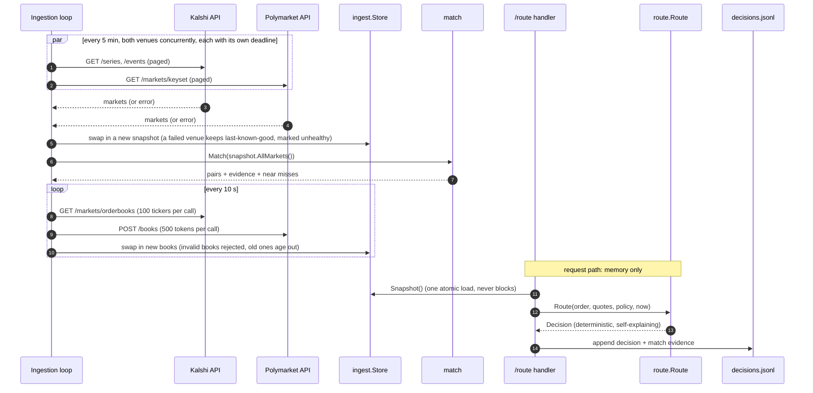
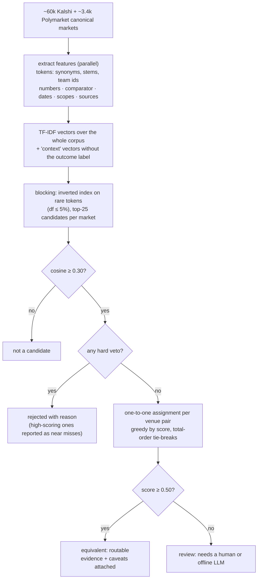
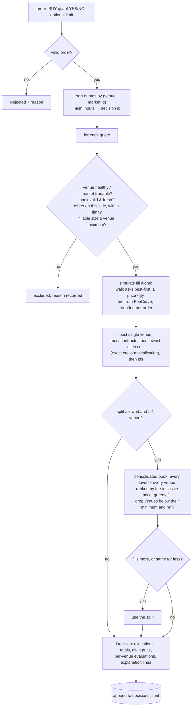
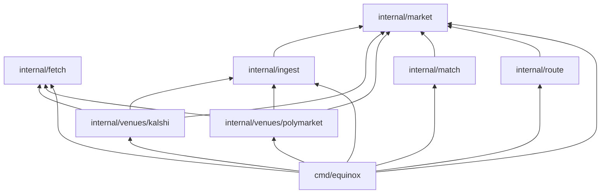

# Project Equinox: System Design

This is the design plan, the reasoning behind it, and the assumptions it depends on. The diagrams below
are also kept as standalone Mermaid files in [`docs/diagrams/`](diagrams/), each with a rendered `.svg`.
For the concepts and tradeoffs behind each decision, read [`ARCHITECTURE.md`](ARCHITECTURE.md).

## 1. The plan in one picture

([`diagrams/system-design.mmd`](diagrams/system-design.mmd))

The system has four layers. Data flows left to right and dependencies point inward:

1. **Venue integration** (`internal/fetch`, `internal/venues/*`). This is the only code that knows a
   venue exists. Each adapter turns one venue's API into canonical markets and books.
2. **Canonical model** (`internal/market`). One definition of a binary market, an order book, money
   (integer micro-dollars) and a fee curve. Everything downstream speaks only this language.
3. **Decision logic** (`internal/match`, `internal/route`). Matching proposes equivalent pairs with
   evidence. Routing is a pure function from an order plus quotes to an explained decision.
4. **Orchestration and interfaces** (`internal/ingest`, `cmd/equinox`). Concurrent ingestion into
   immutable snapshots, then a CLI and an HTTP API that only ever read those snapshots.

## 2. Why this shape

| Requirement (PRD) | Design response | Why this and not something else |
|---|---|---|
| Fetch live data from two venues | One adapter per venue behind a two-method port (`Markets`, `Books`), plus one shared HTTP client | The venues differ in every detail: pagination, book layout, price encoding, fee schedule. Isolating those details is the whole point. A shared client means timeouts, retries and rate limits are written once. |
| Internal market representation | `market.Market` is *one binary proposition*. Multi-outcome events and named-outcome markets (`["Rays","Yankees"]`) are decomposed into one Market per outcome. | Both venues build everything from binary contracts underneath. Making binary the canonical shape means matching is always YES-to-YES and routing never deals with polarity. |
| Identify equivalent markets | A deterministic, explainable matcher: text similarity finds candidates, structured vetoes decide | Research showed that open-source bots using fuzzy text matching produce false matches, and LLM pipelines are non-deterministic and costly. A wrong match routes money into a different bet, so the matcher is built for precision first. See [`EQUIVALENCE.md`](EQUIVALENCE.md). |
| Simulate a routing decision | `route.Route(order, quotes, policy, now) → Decision` | A pure function is deterministic by construction, trivially testable, and cannot block on I/O. |
| Log reasoning | Every decision carries per-venue evaluations, the rule that picked the venue, and plain-English explanation lines. It is appended to `decisions.jsonl` together with the match evidence it relied on | An auditor can reconstruct why money would have gone where it did. The decision ID is a hash of the inputs, so a re-run on the same recorded snapshot can be checked against the log. |
| Deterministic routing | Integer money, sorted inputs, total-order tie-breaks, no clock or randomness inside `Route` | The Go spec allows fused multiply-add on arm64, so float arithmetic can differ between a Mac and an x86 Cloud Run host. Integers can't. |
| Never block on external calls during routing | Ingestion writes immutable snapshots. The router reads one with a single atomic load. | Copy-on-write snapshots give readers lock-free, consistent views. A slow venue delays only its own refresh. |
| Graceful API failure and inconsistent data | Per-venue deadlines, bounded retries, last-known-good data, health flags, per-record validation, book sanity checks, staleness exclusion | Failure is the normal case with two independent public APIs. Each failure mode has a defined behaviour (§6). |
| No venue logic in routing | `route` imports only `market`. Fees arrive as a `FeeCurve` (data), health as a string. A test fails the build if `route` mentions a venue or imports anything else. | An architectural rule that is enforced cannot drift. |

## 3. Assumptions register

Every assumption is written down with the reason for it and what breaks if it turns out wrong.

| ID | Assumption | Why it's reasonable | If wrong | Where it lives |
|---|---|---|---|---|
| **A1** | Every routable contract is binary (pays $1 or $0). Multi-outcome events are sets of binary markets. | Both venues implement multi-outcome events this way: Kalshi has one market per outcome, Polymarket one market per `groupItemTitle` or outcome token. Kalshi `scalar` markets exist but none were open in a 22k sample. | Scalar or range-payout markets would need a different payoff model. Today they are skipped and counted. | `kalshi.normalize`, `polymarket.normalize` |
| **A2** | Public REST polling is good enough for a simulation: books every ~10 s, listings ≤ 15 s stale (Kalshi CDN) or ≤ 5 min (Gamma cache). | The brief is a routing *simulation*, not execution. Books are read from the uncached CLOB / orderbook endpoints. | Real execution needs websocket books and a latency model. The port allows a streaming adapter. | `fetch`, `ingest`, `-books-every` |
| **A3** | Equivalence can only be *inferred* from text and metadata. It is never certain, so precision beats recall, and only the `equivalent` tier is routable. | The 2024 shutdown and Khamenei 2026 markets resolved in opposite directions on the two venues (research/prior_art.md). | Some bets are missed (recall about 0.84 on the labelled set). We accept that. | `match`, routing gate in `cmd/equinox` |
| **A4** | The order is a taker BUY of whole contracts. Displayed depth is fillable at snapshot time. No queue position, partial cancels or latency. | That is the minimum needed to compare venues on all-in cost, which is what the brief asks. | A real SOR needs fill probabilities and a market-impact model. Noted as future work. | `route` |
| **A5** | Fees are computable from venue data: Kalshi series `fee_type`/`fee_multiplier` (with event overrides), Polymarket `feeSchedule {rate, exponent}`. | Both are documented and verified live, with worked examples reproduced in tests. | An unknown fee type (Kalshi `flat`) makes the market untradable rather than mis-priced. | `kalshi.feeCurve`, `polymarket.feeCurve`, `market.FeeCurve` |
| **A6** | A venue whose last refresh failed, or a book older than `MaxBookAge`, is excluded from routing rather than estimated. | Routing on stale data is worse than not routing. | Lower fill availability during outages, by design. | `ingest.Snapshot.Unhealthy`, `route.exclusion` |
| **A7** | Book sizes are floored to whole contracts; Kalshi fees are rounded up to the cent per order; Polymarket fees to $0.00001. Every rounding is conservative. | Both venues document these roundings (Polymarket doesn't give a direction, so we round up). An estimate should never flatter a venue. | Over-estimates cost by under 1¢ per order. | `market.ParseQty`, `FeeCurve.Round` |
| **A8** | Books from both venues are stamped with **receipt time**. Kalshi books carry no timestamp, and Polymarket's `timestamp` is when the book last *changed*, not when we read it, so a quiet but valid book can be minutes old. | Staleness is about our copy of the book. | Staleness may be under-estimated by the network latency (~100 ms). | `kalshi.Books`, `polymarket.Books` |
| **A9** | Ingestion is scoped: Kalshi's first 30 `/events` pages (≈57k markets) and Polymarket's 3,000 most-traded markets by 24-hour volume. | Polymarket lists a very large number of open order-book markets (research estimated 70–85k; a verification crawl about 257k). The liquid ones are where routing matters. | Illiquid overlaps are not found. The page counts are flags. | `-kalshi-pages`, `-poly-pages` |
| **A10** | Different settlement timing doesn't break equivalence of the YES condition (e.g. Kalshi pays when the winner is sworn in, Polymarket when the race is called). It is reported as a caveat because it changes how long capital is locked up. | The YES-region is the same. Timing is a cost, not an outcome. | A reviewer can reject the pair through the reviewed mapping table. | `match.makePair` caveats |

## 4. Runtime flow

([`diagrams/request-sequence.mmd`](diagrams/request-sequence.mmd))

The CLI commands run the same pipeline once (`scan`), or once followed by a single routing decision
(`route`). In both cases the decision is computed only after ingestion has finished.

## 5. Matching and routing pipelines

The matching pipeline ([`diagrams/matching-pipeline.mmd`](diagrams/matching-pipeline.mmd)) is explained in
detail in [`EQUIVALENCE.md`](EQUIVALENCE.md).

The routing decision ([`diagrams/routing-decision.mmd`](diagrams/routing-decision.mmd)) is explained in
detail in [`ROUTING.md`](ROUTING.md).

## 6. Failure handling

| Failure | Detected by | Behaviour | Tested in |
|---|---|---|---|
| Venue down / 5xx / 429 | `fetch.Client` status check | Up to 3 retries with exponential backoff (honours `Retry-After`). Then the venue's refresh fails, its last-known-good markets stay, and it is marked unhealthy, so the router excludes it | `fetch_test`, `ingest_test` |
| Venue slow / hangs | per-venue `context.WithTimeout` | That venue's refresh is cut off at the deadline. Other venues and snapshot readers are unaffected | `TestSlowVenueIsCutOffAndReadersNeverBlock` |
| Malformed JSON | decode error wrapped as `ErrMalformed` | Not retried. The refresh fails as above | `TestDoesNotRetryPermanentFailures`, adapter tests |
| One bad record (odd timestamp, missing token ids, three outcomes) | per-record parsing | The record is skipped or its field left unknown. Reasons are counted in `Stats.Skipped`, and the page still succeeds | adapter tests |
| Inconsistent quotes (Kalshi `0.0000`/`1.0000` empty-side sentinels) | sizes, not prices | A side exists only if its size is greater than 0 | `TestMarketsNormalizesAndCountsSkips` |
| Crossed or empty book | `Book.Validate` at ingest and again in the router | The book is rejected and the previous one kept. It ages out, and the router excludes it with a reason | `TestRefreshBooksDropsInvalidAndKeepsPrevious`, `TestExclusions` |
| Stale book | `now − AsOf > MaxBookAge` | Excluded, with its age stated | `TestExclusions` |
| Market closed / awaiting resolution / unknown fee schedule | `Market.Untradable` reason | Still matched, never routed | adapter tests, `TestExclusions` |
| Invalid order or policy (side, quantity, limit ≤ 0, max book age ≤ 0) | API/CLI validation, then the router | The API returns 400 and the CLI an error. The router itself returns a rejected decision with a reason; it never panics or returns an error | `TestRejectsInvalidOrdersAndNoVenues`, `TestRouteEndpoint` |
| Two quotes for the same market; a book stamped in the future | router | Both copies excluded as conflicting, so the result can't depend on which arrived first; a future-stamped book is excluded | `TestFutureBooksBadPolicyAndConflictingQuotes` |
| Pagination cursor that never advances | adapters | The refresh fails with an error instead of looping until the deadline | `TestRepeatedCursorStopsTheCrawl` (both venues) |
| One batch of book requests fails | adapters + ingest | Other batches are still fetched and used; the failure is logged and counted | `TestBooksKeepsGoodChunksWhenOneFails`, `TestRefreshBooksUsesPartialResults` |
| Process asked to stop (SIGTERM on Cloud Run, Ctrl-C locally) | `signal.NotifyContext` | Background loops stop and the HTTP server shuts down gracefully | |

## 7. Package boundaries

([`diagrams/package-dependencies.mmd`](diagrams/package-dependencies.mmd))

`match` and `route` never see an adapter. Adding a third venue means writing
`internal/venues/<name>`, implementing the three-method `ingest.Venue` port, and registering it in
`setup()` in `cmd/equinox`: construct it with its own rate-limited client and inject the clock. Matching
already compares every pair of venues. Routing works per matched pair; routing across three or more venues
at once would also need pairs clustered into groups, which is not built.

## 8. Measured scale (live run, 2026-10-06 05:33 UTC)

| | |
|---|---|
| Markets ingested | Kalshi 56,776 (30 pages, 4.3 s); Polymarket 3,000 → 3,390 canonical binary markets (30 pages, 8.2 s); both venues in parallel |
| Candidate pairs | about 1.22M scored by cosine; 90,726 cleared the 0.30 floor and went through the vetoes |
| Pairs proposed | 374 (341 `equivalent`, 33 `review`; with the reviewed table applied: 330 equivalent, 40 rejected, 4 review) |
| Matching time | about 7 s on 10 cores (replay), about 11 s in a 4-CPU container |
| Order books | 5 batched calls for 374 pairs: 4 Kalshi GETs of 100 tickers (0.37 s, 372/374 valid) and 1 Polymarket POST (2.3 s, 374/374 valid) |
| Peak memory | about 670 MB resident during a full scan |
| Routing | microseconds per decision, with no I/O |
